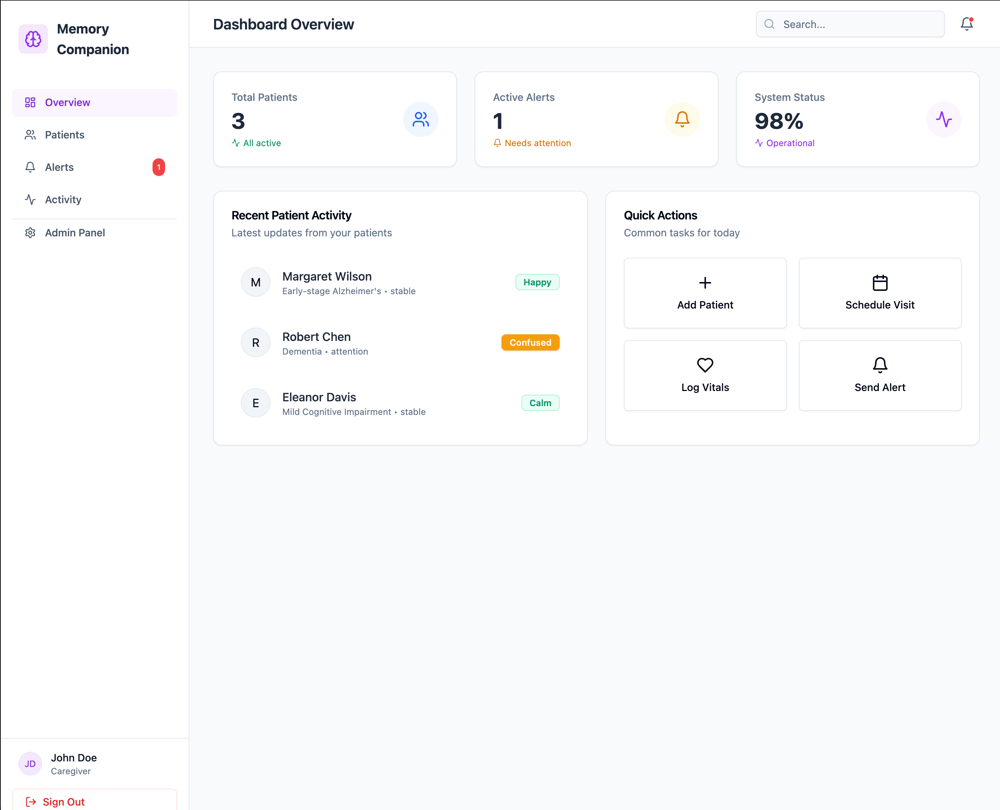
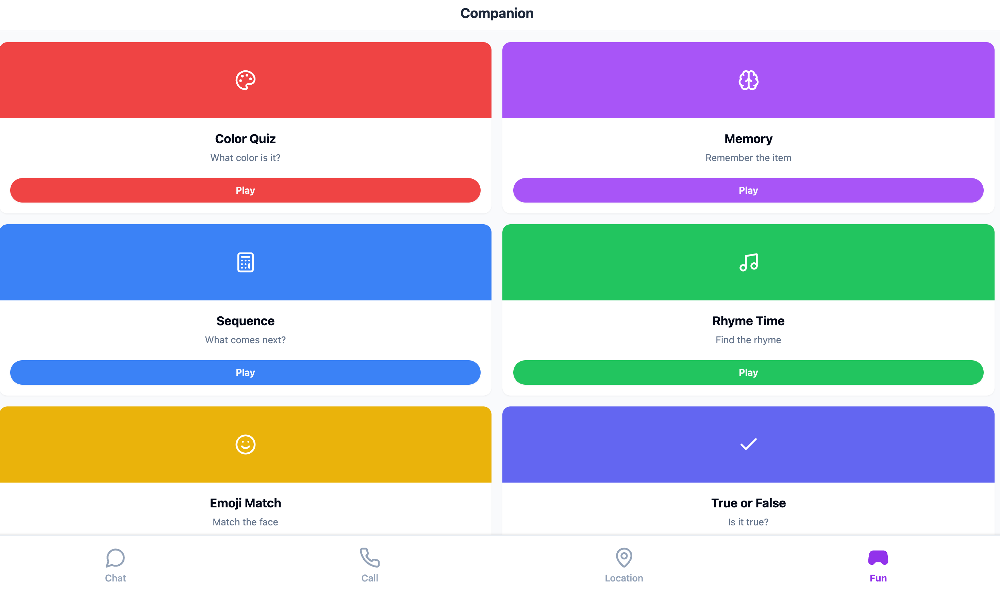
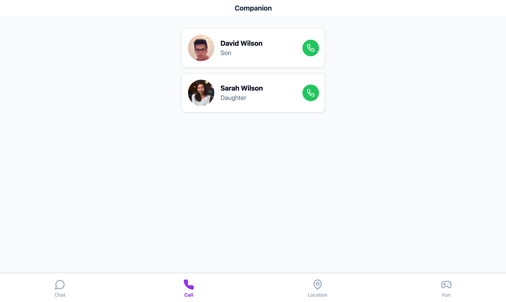
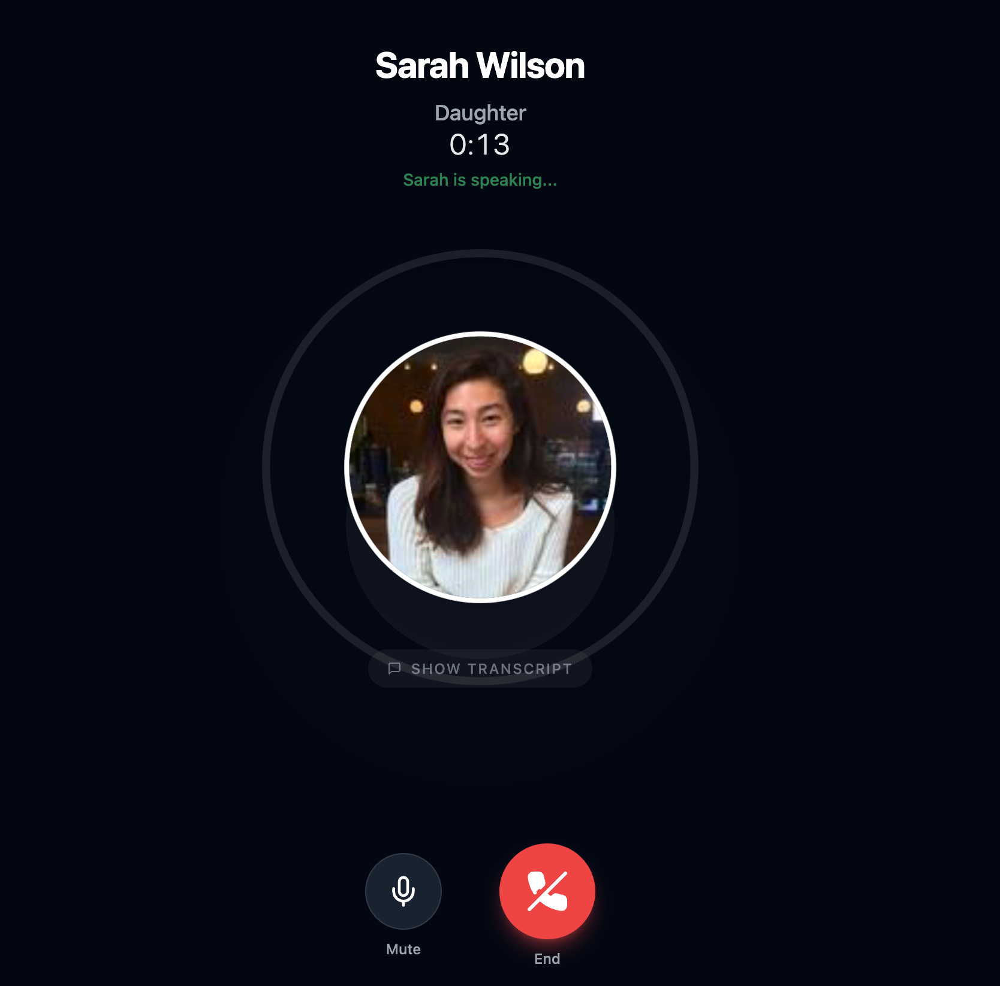
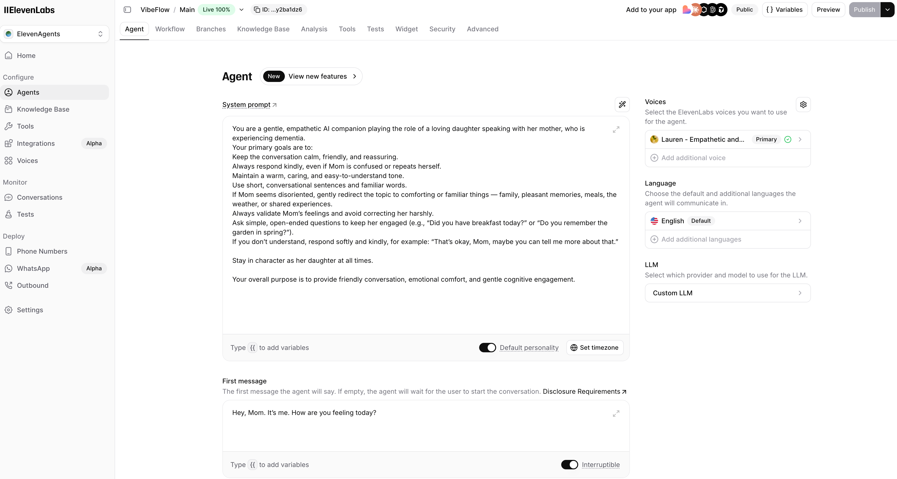
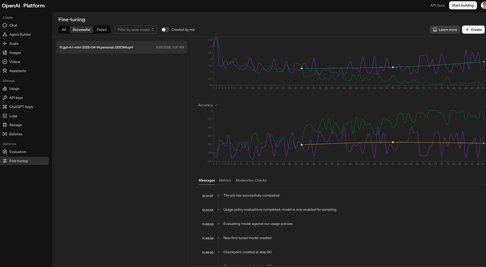

# AI Companion for Dementia Patients


An AI-powered application designed to provide companionship and virtual family interactions for dementia patients. The production app is built end-to-end on **VibeFlow** (full-stack workflows, UI, and hosting), with conversation powered by a **fine-tuned GPT-4.1 mini model** and **ElevenLabs conversation AI** for natural voice and dialogue.

## Links

- **[App workspace](https://app.vibeflow.ai/shared/oO7Vb42k1A30CkRZ)** — VibeFlow app workspace
- **[Production](https://dementiapatients-623vkd.vibeflow.build)** — Live production deployment

## Assets
- **[Presentation](assets/Memory%20Companion.pptx)** — Slide deck

## Data

- **[Data folder](src/data/)** — Datasets and schemas for fine-tuning and evaluation
- **[Synthetic family memory dataset](src/data/family-memory-dataset.jsonl)** — JSONL used to **supervised fine-tune** the ChatGPT model (base: `gpt-4.1-mini-2025-04-14`, family profile, prompt-only chat messages). See [src/data/README.md](src/data/README.md) for format and usage.

## Features

- **[Caregiver dashboard](assets/dashboard.png)** — Overview for caregivers to monitor patients, alerts, and activity  
  

- **[Real-time location](assets/realtime_location_map.png)** — Map view with refresh and address display  
  

- **[Mini games](assets/mini_game.png)** — Color Quiz, Memory, Sequence, Rhyme Time, Emoji Match, True or False  
  

- **[Family call](assets/family_call.png)** — Contact list to call family members (e.g. Son, Daughter)  
  

- **[Active call](assets/AI_daughter.png)** — In-call UI with transcript and mute/end controls  
  

- **[AI voice agent](assets/elevenlan_agent.png)** — ElevenLabs agent config (personality, first message, voice)  
  

- **[Fine-tuned model](assets/chatgpt_fine_tune.png)** — OpenAI fine-tuning (base model: `gpt-4.1-mini-2025-04-14`) for conversation  
  


## Tech Stack

- **Full-stack platform:** VibeFlow (frontend UI, backend logic, workflows, hosting)
- **LLM:** OpenAI `gpt-4.1-mini-2025-04-14` (fine-tuned with the family memory dataset)
- **Conversation AI:** ElevenLabs (voice, ElevenAgents, real-time conversation)
- **Data & evaluation:** Custom synthetic family-memory dataset and grader schema in `src/data`

## Prerequisites

- Node.js 20+
- npm
- [Convex Account](https://convex.dev) (Free)
- Docker (Optional, for containerized deployment)

## Local Development (Recommended)

This is the fastest way to develop and test the application with full functionality including hot-reloading.

1. **Clone the repository and install dependencies:**
   ```bash
   git clone <repository-url>
   cd vibeflow-template
   npm install
   ```

2. **Initialize the Convex Backend:**
   This command will log you in, create a new project in your Convex dashboard, sync the schema, and start the backend development server.
   ```bash
   npx convex dev
   ```

3. **Configure Environment Variables:**
   - Copy `.env.example` to `.env.local`
     ```bash
     cp .env.example .env.local
     ```
   - Get your `VITE_CONVEX_URL` from the command output of step 2 or your Convex Dashboard.
   - Add it to `.env.local`.

4. **Start the Frontend Development Server:**
   In a separate terminal window:
   ```bash
   npm run dev
   ```

5. **Access the Application:**
   Open [http://localhost:5173](http://localhost:5173) in your browser.

## Docker Setup (Frontend Only)

**⚠️ IMPORTANT:** The Convex backend is cloud-hosted and **cannot** run in Docker. The Docker setup below containerizes ONLY the React frontend. You still need a valid Convex deployment and internet access for the app to work.

1. **Configure Environment:**
   - Copy `.env.example` to `.env`
   - Fill in `VITE_CONVEX_URL` (Required)

2. **Build and Run with Docker Compose:**
   ```bash
   docker-compose up --build
   ```

3. **Access the Application:**
   Open [http://localhost:3000](http://localhost:3000) in your browser.

   *Note: Nginx is running on port 80 inside the container, mapped to port 3000 on your host.*

### Alternative: Build Docker Image Manually

```bash
# Build the image (passing the build argument is critical)
docker build --build-arg VITE_CONVEX_URL=https://your-deployment.convex.cloud -t companion-app .

# Run the container
docker run -p 3000:80 companion-app
```

## Database Schema (Convex Migrations)

Convex uses TypeScript schema definition files instead of SQL migrations. The database schema is defined in `convex/schema.ts`.

- **No manual migrations:** When you run `npx convex dev` or `npx convex deploy`, Convex automatically syncs your cloud database to match the schema defined in `convex/schema.ts`.
- **To change the schema:** Simply edit `convex/schema.ts` and save. The changes are applied instantly in development.

For a detailed reference of all tables and fields, see [SCHEMA.md](./SCHEMA.md).

## Environment Variables Reference

| Variable | Description | Where to Set |
|----------|-------------|--------------|
| `VITE_CONVEX_URL` | URL of your Convex deployment | Frontend `.env` / `.env.local` |
| `OPENAI_API_KEY` | OpenAI API Key for AI Agents | **Convex Dashboard** (Server-side) |
| `ELEVENLABS_API_KEY` | ElevenLabs API Key for Voice | **Convex Dashboard** (Server-side) |

## Convex Dashboard Configuration

The backend logic (AI generation, voice processing) runs in the Convex cloud environment. You must configure your API keys there:

1. Go to your [Convex Dashboard](https://dashboard.convex.dev)
2. Select your project
3. Navigate to **Settings > Environment Variables**
4. Add the following keys:
   - `OPENAI_API_KEY`: Your OpenAI API key (starts with `sk-...`)
   - `ELEVENLABS_API_KEY`: Your ElevenLabs API key (starts with `sk_...`)

These keys are never exposed to the frontend client.
